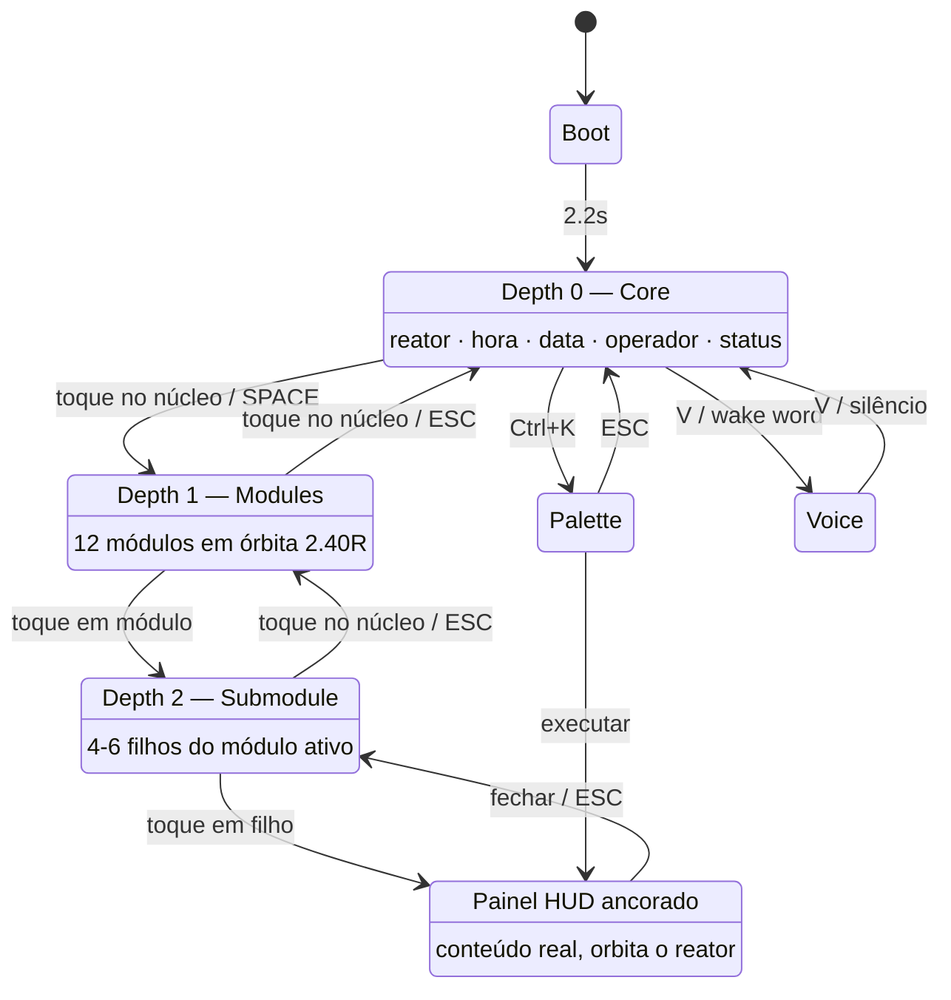

# 04 — Navegação radial

Não existe sidebar, drawer, tab bar ou página. Existe **profundidade orbital**.

---

## 1. Fluxo



### 1.1 Regras invioláveis

1. **O reator nunca sai do centro** em nenhum estado, em nenhuma profundidade.
2. **Nunca há mais de 2 níveis orbitais.** O terceiro nível é um painel, não uma órbita.
3. **O núcleo é sempre o botão "voltar".** Não existe seta de retorno.
4. **Transição de nível é colapso → troca → expansão** (contrato 50/50, ver §3).
5. **Painéis orbitam, não cobrem.** O reator permanece visível e ativo atrás/ao lado.

---

## 2. Wireframes

### 2.1 Depth 0 — Core (ocioso)

```
┌────────────────────────────────────────────────────────────┐
│ OPERATOR                ● ○ ○  CORE           LOCAL        │
│ MATHEUS VINICIUS                              THU 31 JUL   │
│                                                            │
│ CLEARANCE                                     UPTIME       │
│ ROOT · TIER 01                                00:14:22     │
│                                                            │
│                                                            │
│                        ╔═══════════╗                       │
│                        ║ ▓▓▒░ ● ░▒▓▓ ║   ← reator          │
│                        ╚═══════════╝                       │
│                                                            │
│                           21:47                            │   ← display grande
│                    GOOD EVENING, MATHEUS                   │
│                                                            │
│                                                            │
│ CORE LOAD                                    ( ● ) STANDBY │
│ 08.4 %                                                     │
│ LATENCY                                       LINK         │
│ 012 MS                            GRPC · 127.0.0.1:50051   │
└────────────────────────────────────────────────────────────┘
```

Cinco informações. Nada mais. ~8% de ocupação.

### 2.2 Depth 1 — Modules

```
┌────────────────────────────────────────────────────────────┐
│ OPERATOR                ● ● ○  CORE · MODULES     LOCAL    │
│ MATHEUS VINICIUS                                           │
│                            ◇ AI                            │
│                  ⬡ SETTINGS   ▤ MEMORY                     │
│                                                            │
│           ▣ SYSTEM      ╔═══════╗       ◈ AGENTS           │
│                         ║ ▒░●░▒ ║                          │
│          ≋ NETWORK      ╚═══════╝        ▢ FILES           │
│                           21:47                            │
│              ∿ VOICE            ▦ PROJECTS                 │
│                    ⛨ SECURITY  ▸ TERMINAL                  │
│                            ◍ BROWSER                       │
│                                                            │
│ CORE LOAD                                    ( ● ) STANDBY │
└────────────────────────────────────────────────────────────┘
```

### 2.3 Depth 1 — hover em módulo (setor anular)

```
                    ╱▔▔▔▔▔▔▔╲
                  ╱ ▓▓ ◇ AI ▓▓ ╲     ← setor anular Arc 17%
                 │ ▓▓▓▓▓▓▓▓▓▓▓ │       stroke 1px Arc 46%
        ⬡ SETTINGS ╲▓▓▓▓▓▓▓▓▓╱  ▤ MEMORY
                     ╲▁▁▁▁▁╱
                    ╔═══════╗
                    ║ ▒░ ● ░▒ ║
                    ╚═══════╝
```

Ícone em hover: `Ignition`, escala ×1.22, glow 16px. Rótulo passa de `InkLo` para `Ignition`.
Anéis aceleram sutilmente. Cursor cresce ×1.5.

### 2.4 Depth 2 — Submodule + painel

```
┌────────────────────────────────────────────────────────────┐
│ OPERATOR                ● ● ●  CORE · MEMORY               │
│                                                            │
│              ▤ RECENT      ┌──────────────────────────┐    │
│                            │ ▸ MEMORY · SEMANTIC    ✕ │    │
│         ▤ SEMANTIC         ├──────────────────────────┤    │
│             ╔═══════╗      │┃ SEMANTIC INDEX    4.2MB │    │
│             ║ ▒░ ● ░▒ ║    │┃ 1 284 vetores           │    │
│             ╚═══════╝      │                          │    │
│         ▤ EPISODIC         │┃ EPISODIC BUFFER   1.1MB │    │
│                            │┃ 312 eventos             │    │
│              ▤ PURGE       ├──────────────────────────┤    │
│                            │ 1 284 ENTRIES  LAST 04:21│    │
│                            └──────────────────────────┘    │
└────────────────────────────────────────────────────────────┘
```

O painel ancora a `3.4 R` no quadrante oposto ao item selecionado, para não cobri-lo.

---

## 3. Contrato de transição 50/50

Trocar de nível **não** é um cross-fade. É uma sequência em duas metades, já implementada em
`ui-engine/Controls/RadialMenu.cs` (`TransitionTo`):

```
t=0.0 ─────────── t=0.5 ─────────── t=1.0
│ colapso           │ expansão        │
│ itens → r=0       │ itens r=0 → 2.4R│
│ opacidade → 0     │ opacidade → 1   │
│ escala → 0.3      │ escala 0.3 → 1  │
                    ▲
                    └─ troca do conjunto de itens (invisível)
```

Duração total ≈ 550ms (`DurSlow`). O usuário percebe **um** movimento contínuo, não dois.

---

## 4. Mapa de módulos

12 módulos no nível 1. O número é deliberado: `360° / 12 = 30°` por setor, o menor ângulo
que ainda comporta ícone + rótulo sem colisão em 1280px de largura.

| # | Módulo | Ícone | Filhos |
|---|---|---|---|
| 01 | **AI** | hexágono + ponto | Models · Prompts · Context · Tuning · Evals |
| 02 | **Memory** | camadas | Recent · Semantic · Episodic · Purge |
| 03 | **Agents** | nós conectados | Active · Queue · Registry · Logs · Spawn |
| 04 | **Files** | pasta | Recent · Index · Vault · Sync |
| 05 | **Projects** | grade 2×2 | Active · Archive · Tasks · Timeline |
| 06 | **Terminal** | prompt | Shell · History · Jobs · SSH |
| 07 | **Browser** | globo | Tabs · Research · Capture · Marks |
| 08 | **Security** | escudo | Keys · Audit · Perms · Threats |
| 09 | **Voice** | waveform | Listen · Voices · Phrases · Latency |
| 10 | **Network** | sinal | Nodes · Traffic · Devices · VPN |
| 11 | **System** | chip | CPU · Memory · Disk · Power · Temp |
| 12 | **Settings** | engrenagem | Core · Voice · Theme · About |

### 4.1 Ligação com as HUD Pages existentes

As 15 páginas da FASE 7 permanecem e passam a ser **destinos** do nível 2, redesenhadas com os
tokens ARC e envelopadas em `ArcHudPanel`:

| Página existente | Rota radial |
|---|---|
| `BrainPage` | AI · Models |
| `MemoryPage` | Memory · Semantic |
| `LearningPage` | AI · Tuning |
| `DecisionPage` | AI · Context |
| `PlanningPage` | Projects · Tasks |
| `AutomationPage` | Agents · Queue |
| `SchedulerPage` | Agents · Queue |
| `VoicePage` | Voice · Listen |
| `WorldPage` | Network · Nodes |
| `MetricsPage` | System · CPU |
| `LogsPage` | Agents · Logs |
| `PluginPage` | Agents · Registry |
| `DeveloperPage` | Terminal · Shell |
| `DebugPage` | Terminal · Jobs |
| `SettingsPage` | Settings · Core |

---

## 5. Entrada

| Gesto / tecla | Ação |
|---|---|
| Toque no núcleo | Avança de 0→1, ou retorna de 2→1, 1→0 |
| `Espaço` | Alterna Depth 0 ↔ 1 |
| `Esc` | Sobe um nível; fecha overlay se aberto |
| Toque em módulo | Desce um nível |
| `Ctrl/Cmd + K` ou `/` | Command Palette |
| `V` | Alterna escuta de voz |
| Pressão longa / botão direito | Context Menu no ponto do gesto |
| `Tab` | Percorre itens orbitais em ordem angular horária |
| `Setas ← →` | Move o setor anular entre módulos adjacentes |
| `Enter` | Ativa o item com setor ativo |

**Navegação por teclado é obrigatória.** O setor anular é o indicador de foco — ele serve
mouse e teclado com a mesma forma.

---

## 6. Responsividade

| Alvo | Largura | Adaptação |
|---|---|---|
| **Mobile** | < 600px | `R` no piso de 52px. Órbita reduz para `2.10 R`. Rótulos orbitais ocultos até hover/foco. Telemetria: só canto inferior direito. Nível 2 abre painel em folha inferior (85% da altura). |
| **Dobrável (fechado)** | 600–840px | Como mobile, com rótulos visíveis. |
| **Dobrável (aberto)** | 840–1100px | Reator centralizado na dobra; painéis sempre no lado oposto ao vinco. |
| **Tablet** | 840–1280px | Layout completo. Painéis a `min(380px, 40vw)`. |
| **Desktop** | 1280–1920px | Referência de projeto. |
| **Ultrawide** | > 1920px | `R` no teto de 104px. Reator permanece centralizado; telemetria ancora nos cantos reais, não em uma coluna central. Até 3 painéis flutuantes lado a lado. |

**Nunca** reflua o reator para fora do centro. Em qualquer viewport, o centro geométrico é o
centro do reator.
